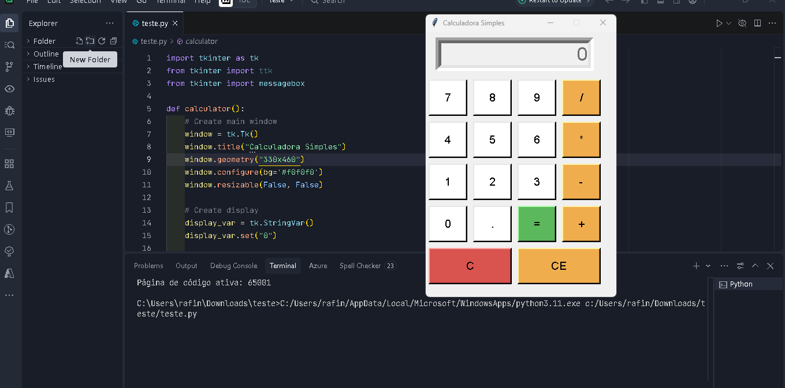

# Calculadora em Python 🧮

Projeto simples de uma **calculadora interativa em Python** com interface gráfica.

## 📌 Sobre o projeto
Este projeto tem como objetivo criar uma calculadora funcional utilizando **Python** e uma janela interativa (GUI).  
Ele permite realizar operações matemáticas básicas de forma prática.

## 🚀 Tecnologias utilizadas
- [Python 3](https://www.python.org/)
- Biblioteca padrão `tkinter` (para a interface gráfica)

## 📂 Estrutura do projeto
```bash
calculadora_py/
│── calculadora.py # Código principal da calculadora
│── README.md # Documentação do projeto
│── LICENSE # Licença MIT
```

## ▶️ Como executar
1. Clone este repositório:
   ```bash
   git clone https://github.com/shakarpg/calculadora_py.git
Acesse a pasta do projeto:
```bash
cd calculadora_py
```
Execute o programa:
```bash
python calculadora.py
```

## 📸 Demonstração


## 📜 Licença

Este projeto está sob licença MIT .
